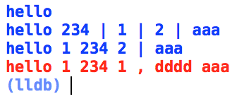

## 使用说明

类似于java slf4j 的api，通过 {} 进行占位， 并支持颜色

    LULog.debug("hello")

    LULog.debug("hello 234", args: 1 , 2 , "aaa")

    LULog.debug("hello {} 234 {}", args: 1 , 2 , "aaa")

    LULog.error("hello {} 234 {} , dddd {}", args: 1 , true , "aaa")

效果：

#